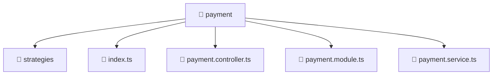

<!--
Mavluda Beauty - Luxury Professional Documentation
Generated for 100% Architectural Transparency
-->
[Home](../../../../README.md) > [backend](../../../README.md) > [src](../../README.md) > [modules](../README.md) > [payment](./README.md)

# 💳 PAYMENT Directory

## 🎯 PURPOSE
Manages the payment module, providing robust and secure backend services for the Mavluda Beauty application.

## 🏗️ ARCHITECTURE


## 📄 FILE REGISTRY
| File Name | Type | Responsibility | Key Aliases Used |
|---|---|---|---|
| `index.ts` | TypeScript | Core logic implementation. | - |
| `payment.controller.ts` | TypeScript | Request routing and response handling. | @nestjs |
| `payment.module.ts` | TypeScript | Module configuration and dependency injection. | @nestjs |
| `payment.service.ts` | TypeScript | Business logic and service orchestration. | @nestjs |


## 🔗 DEPENDENCIES
- `@nestjs/common`
- `./payment.service`
- `./strategies/payment.strategy`
- `./payment.controller`
- `./strategies/alif-pay.strategy`
- `./strategies/mock-card.strategy`

## 🛠️ USAGE
```typescript
// Example placeholder for interacting with payment
// Consult the individual files in the registry for specific APIs.
```
