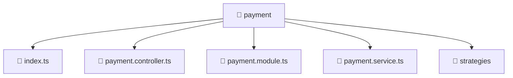

# 📁 payment

[Root](/.) > [backend](/backend) > [src](/backend/src) > [modules](/backend/src/modules) > [payment](/backend/src/modules/payment)

## 🎯 Purpose
Delivering luxury-tier architectural components and high-performance logic for the **payment** domain. This directory is a crucial part of the Mavluda Beauty full-stack ecosystem, ensuring seamless scalability, robust performance, and an elite digital experience.

## 🏗️ Architecture


## 📄 File Registry
| File Name | Type | Responsibility | Key Aliases Used |
|---|---|---|---|
| `index.ts` | TypeScript | Handles logic and definitions for index.ts | None |
| `payment.controller.ts` | TypeScript | Handles incoming requests and routing for payment | None |
| `payment.module.ts` | TypeScript | Defines module boundaries for payment | @nestjs/common |
| `payment.service.ts` | TypeScript | Encapsulates business logic for payment | @nestjs/common |

## 🔗 Dependencies
- `./payment.controller`
- `./payment.service`
- `./strategies/alif-pay.strategy`
- `./strategies/mock-card.strategy`
- `./strategies/payment.strategy`
- `@nestjs/common`

## 🛠️ Usage
```typescript
// Example usage within the Mavluda Beauty ecosystem
import { relevantMember } from './payment';

// Integrate into the application architecture
relevantMember.execute();
```
