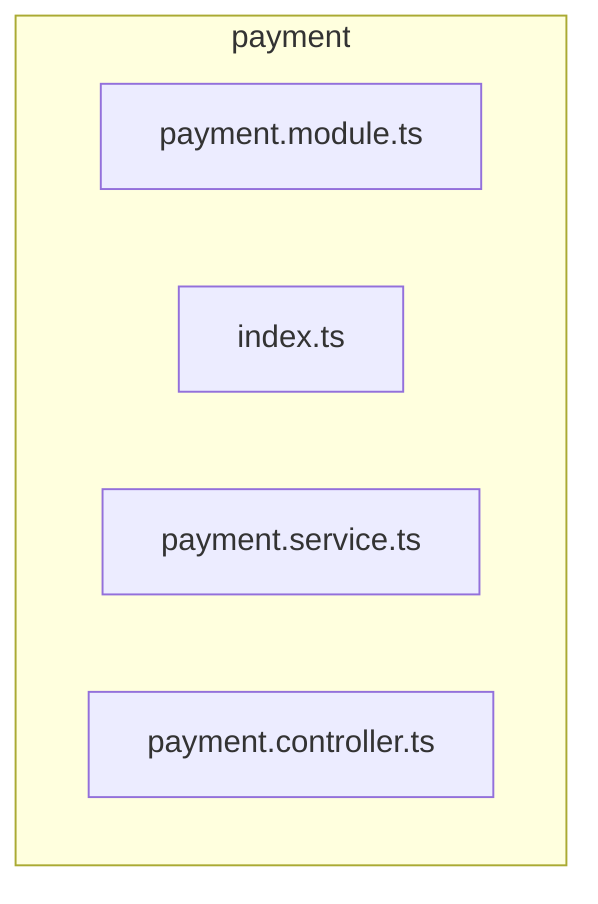

# 💳 payment

[backend](../../../README.md) > [src](../../README.md) > [modules](../README.md) > [payment](README.md)

---

### 🎯 PURPOSE
Elevating the digital experience for the Mavluda Beauty ecosystem, this module manages the sophisticated Feature Module Layer (Bounded Contexts) operations.

*FSD Layer:* **Feature Module Layer (Bounded Contexts)**

---

### 🏗️ ARCHITECTURE



---

### 📄 FILE REGISTRY
| File Name | Type | Responsibility | Key Aliases Used |
|-----------|------|----------------|------------------|
| `payment.module.ts` | Module | Handles module logic for Mavluda Beauty's luxury standards. | `@nestjs` |
| `index.ts` | Source | Handles source logic for Mavluda Beauty's luxury standards. | `None` |
| `payment.service.ts` | Service | Handles service logic for Mavluda Beauty's luxury standards. | `@nestjs` |
| `payment.controller.ts` | Controller | Handles controller logic for Mavluda Beauty's luxury standards. | `@nestjs` |

---

### 🔗 DEPENDENCIES
**Key Path Aliases Detected:** `@nestjs`

Notable imports:
- `./payment.service`
- `./strategies/payment.strategy`
- `./payment.controller`
- `@nestjs/common`
- `./strategies/mock-card.strategy`
- `./payment.module`
- `./strategies/alif-pay.strategy`

---

### 🛠️ USAGE
To interact with this directory's luxurious logic, integrate its exported components or services directly into your feature modules. Ensure strict adherence to the Feature Module Layer (Bounded Contexts) boundaries.

```typescript
// Example integration snippet
import { FeatureModule } from '@path/to/payment';
```
