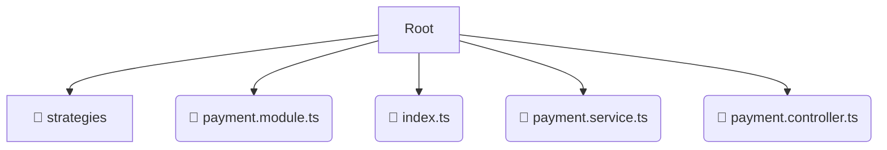

# 📂 payment

*Breadcrumbs:* [backend](/backend) / [src](/backend/src) / [modules](/backend/src/modules) / [payment](/backend/src/modules/payment)

## 🎯 PURPOSE
This directory `payment` is an integral part of the Mavluda Beauty ecosystem. It supports the scalable NestJS backend architecture.
This directory is meticulously maintained to uphold the 'Luxury Professional' standards of the Mavluda Beauty brand.

## 🏗️ ARCHITECTURE


## 📄 FILE REGISTRY
| File Name | Type | Responsibility | Key Aliases Used |
|---|---|---|---|
| `payment.module.ts` | `ts` | Module configuration | `@nestjs/common` |
| `index.ts` | `ts` | Core functionality | `None` |
| `payment.service.ts` | `ts` | Core functionality | `@nestjs/common` |
| `payment.controller.ts` | `ts` | Core functionality | `@nestjs/common` |

## 🔗 DEPENDENCIES
- `@nestjs/common`

## 🛠️ USAGE
```typescript
// Example placeholder for interacting with the payment module
import { example } from './payment.module.ts';
```
