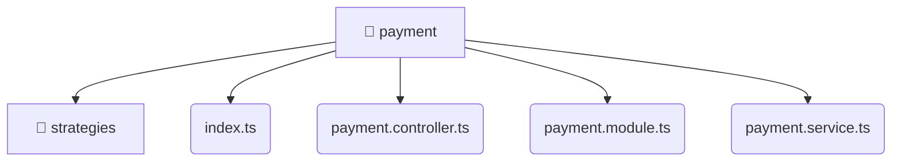

# [backend](/backend) / [src](/backend/src) / [modules](/backend/src/modules) / [payment](/backend/src/modules/payment)

## 🏷️ 📁 Payment

### 🎯 PURPOSE
The `payment` directory forms a critical foundation within the Mavluda Beauty ecosystem, meticulously orchestrating the payment logic to ensure a seamless and premium experience. Rooted in the NestJS backend architecture, it delivers robust, high-performance operations tailored for high-end beauty and wedding services.

### 🏗️ ARCHITECTURE


### 📄 FILE REGISTRY
| File Name | Type | Responsibility | Key Aliases Used |
|---|---|---|---|
| `index.ts` | `ts` | Encapsulates premium logic and definitions for `index.ts`. | None |
| `payment.controller.ts` | `ts` | Encapsulates premium logic and definitions for `payment.controller.ts`. | @nestjs/common |
| `payment.module.ts` | `ts` | Encapsulates premium logic and definitions for `payment.module.ts`. | @nestjs/common |
| `payment.service.ts` | `ts` | Encapsulates premium logic and definitions for `payment.service.ts`. | @nestjs/common |


### 🔗 DEPENDENCIES
- `@nestjs/common`

### 🛠️ USAGE
```typescript
// Seamlessly integrate payment into your refined workflows:
import { /* exported members */ } from '@path/to/payment';
```
