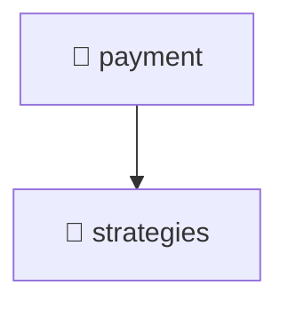

# 📁 payment

[Root](/.) > [backend](/backend) > [src](/backend/src) > [modules](/backend/src/modules) > [payment](/backend/src/modules/payment)

## 🎯 Purpose
Delivering luxury-tier architectural components and high-performance logic for the **payment** domain. This directory is a crucial part of the Mavluda Beauty full-stack ecosystem, ensuring seamless scalability, robust performance, and an elite digital experience.
> **FSD Layer:** Modules (Backend FSD) - Adhering to strict Feature Sliced Design architectural constraints.

## 🏗️ Architecture


## 📄 File Registry
| File Name | Type | Responsibility | Key Aliases Used |
|---|---|---|---|
| `index.ts` | File | Core logic and utilities for this domain. | N/A |
| `payment.controller.ts` | Controller | Request handling and routing. | @nestjs |
| `payment.module.ts` | Module | Core logic and utilities for this domain. | @nestjs |
| `payment.service.ts` | Service | Business logic and state management. | @nestjs |


## 🔗 Dependencies
- `./strategies/payment.strategy`
- `./payment.service`
- `./payment.module`
- `@nestjs/common`
- `./payment.controller`
- `./strategies/alif-pay.strategy`
- `./strategies/mock-card.strategy`

## 🛠️ Usage
```typescript
// Example usage within the Mavluda Beauty ecosystem
import { relevantMember } from './index';

// Integrate into the application architecture
relevantMember.execute();
```
