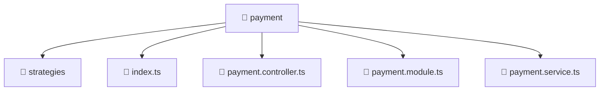

# 📁 payment

[Root](/.) > [backend](/backend) > [src](/backend/src) > [modules](/backend/src/modules) > [payment](/backend/src/modules/payment)

## 🎯 Purpose
Backend module defining application routes, business logic, and data access for the domain.

## 🏗️ Architecture


## 📄 File Registry
| File Name | Type | Responsibility | Key Aliases Used |
|---|---|---|---|
| `index.ts` | TypeScript | Provides core logic and orchestration for index.ts. | N/A |
| `payment.controller.ts` | TypeScript | Handles incoming HTTP requests and routing for payment.controller.ts. | N/A |
| `payment.module.ts` | TypeScript | Defines the architectural module boundaries for payment.module.ts. | @nestjs |
| `payment.service.ts` | TypeScript | Encapsulates business logic and data access for payment.service.ts. | @nestjs |

## 🔗 Dependencies
- `./payment.controller`
- `./payment.service`
- `./strategies/alif-pay.strategy`
- `./strategies/mock-card.strategy`
- `./strategies/payment.strategy`
- `@nestjs/common`

## 🛠️ Usage
```typescript
import { Module } from '@nestjs/common';
// Import specific services/controllers provided by this module
```
