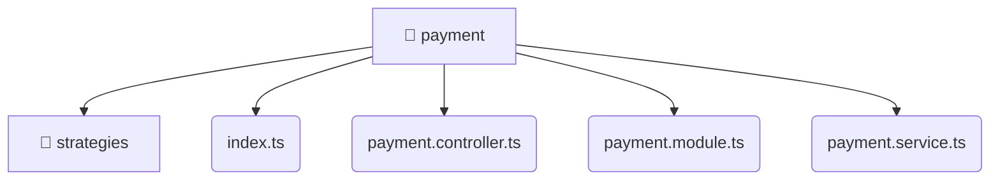

# [root](/) / [backend](/backend) / [src](/backend/src) / [modules](/backend/src/modules) / [payment](/backend/src/modules/payment)

## 🏷️ 📁 Payment

### 🎯 PURPOSE
The `payment` directory forms a critical foundation within the Mavluda Beauty ecosystem, meticulously orchestrating the payment logic to ensure a seamless and premium experience.

### 🏗️ ARCHITECTURE


### 📄 FILE REGISTRY
| File Name | Type | Responsibility | Key Aliases Used |
|---|---|---|---|
| `index.ts` | `ts` | Core logic implementation. | None |
| `payment.controller.ts` | `ts` | Handles incoming HTTP requests. | @nestjs |
| `payment.module.ts` | `ts` | Module configuration and provider registration. | @nestjs |
| `payment.service.ts` | `ts` | Business logic and service layer. | @nestjs |

### 🔗 DEPENDENCIES
- `./payment.controller`
- `./payment.module`
- `./payment.service`
- `./strategies/alif-pay.strategy`
- `./strategies/mock-card.strategy`
- `./strategies/payment.strategy`
- `@nestjs/common`

### 🛠️ USAGE
```typescript
// Seamlessly integrate payment into your refined workflows:
import { /* exported members */ } from '@path/to/payment';
```
