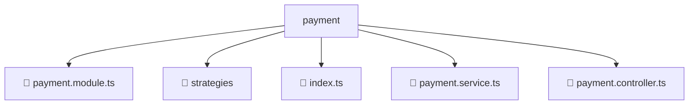

# 📂 PAYMENT

> 💎 **Mavluda Beauty - Luxury Professional Architecture**

### 📍 Breadcrumb Navigation
`. > backend > src > modules > payment`

## 🎯 PURPOSE
This directory encapsulates `Module Root` level functionality within the Mavluda Beauty ecosystem, ensuring proper separation of concerns and architectural transparency.

**FSD / Architecture Layer:** `Module Root`

## 🏗️ ARCHITECTURE


## 📄 FILE REGISTRY

| Item Name | Type | Responsibility | Key Aliases Used |
|-----------|------|----------------|------------------|
| `📄 payment.module.ts` | `.ts` | Module configuration | `@nestjs/common` |
| `📁 strategies` | `Directory` | Subdirectory logic grouping | `None` |
| `📄 index.ts` | `.ts` | General functionality | `None` |
| `📄 payment.service.ts` | `.ts` | Service logic | `@nestjs/common` |
| `📄 payment.controller.ts` | `.ts` | Controller logic | `@nestjs/common` |

## 🔗 DEPENDENCIES
- `@nestjs/common`

## 🛠️ USAGE
```typescript
// Example usage context
import { ... } from './payment.module';

// Integrate payment.module logic into your feature.
```
