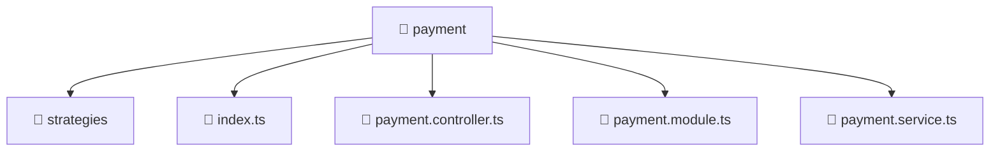

# 📁 payment

[Root](/../../../../README.md) / [backend](../../../README.md) / [src](../../README.md) / [modules](../README.md) / [payment](./README.md)

## 🎯 Purpose
Delivering luxury-tier architectural components and high-performance logic for the **payment** domain. This directory is a crucial part of the Mavluda Beauty full-stack ecosystem, ensuring seamless scalability, robust performance, and an elite digital experience.

## 🏗️ Architecture


## 📄 File Registry
| File Name | Type | Responsibility | Key Aliases Used |
|---|---|---|---|
| `index.ts` | TypeScript | Provides core logic and orchestration for index.ts. | N/A |
| `payment.controller.ts` | Controller | Handles incoming HTTP requests and routing for payment.controller.ts. | N/A |
| `payment.module.ts` | Module | Defines the architectural module boundaries for payment.module.ts. | @nestjs |
| `payment.service.ts` | Service | Encapsulates business logic and data access for payment.service.ts. | @nestjs |


## 🔗 Dependencies
**Internal / Aliases:**
- `./payment.controller`
- `./payment.service`
- `./strategies/alif-pay.strategy`
- `./strategies/mock-card.strategy`
- `./strategies/payment.strategy`
- `@nestjs/common`


## 🛠️ Usage
```typescript
// Example usage within the Mavluda Beauty ecosystem
import { relevantMember } from './index';

// Integrate into the application architecture
relevantMember.execute();
```
