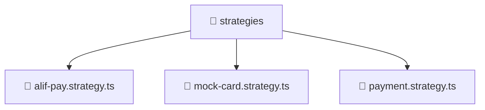

<!--
Mavluda Beauty - Luxury Professional Documentation
Generated for 100% Architectural Transparency
-->
[Home](../../../../../README.md) > [backend](../../../../README.md) > [src](../../../README.md) > [modules](../../README.md) > [payment](../README.md) > [strategies](./README.md)

# 📁 STRATEGIES Directory

## 🎯 PURPOSE
Manages the strategies module, providing robust and secure backend services for the Mavluda Beauty application.

## 🏗️ ARCHITECTURE


## 📄 FILE REGISTRY
| File Name | Type | Responsibility | Key Aliases Used |
|---|---|---|---|
| `alif-pay.strategy.ts` | TypeScript | Core logic implementation. | @nestjs |
| `mock-card.strategy.ts` | TypeScript | Core logic implementation. | @nestjs |
| `payment.strategy.ts` | TypeScript | Core logic implementation. | - |


## 🔗 DEPENDENCIES
- `@nestjs/common`

## 🛠️ USAGE
```typescript
// Example placeholder for interacting with strategies
// Consult the individual files in the registry for specific APIs.
```
