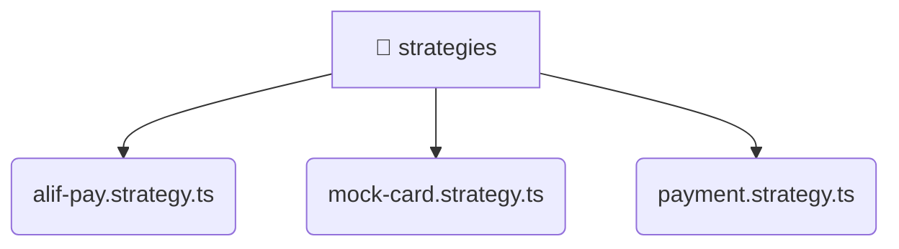

# [backend](/backend) / [src](/backend/src) / [modules](/backend/src/modules) / [payment](/backend/src/modules/payment) / [strategies](/backend/src/modules/payment/strategies)

## 🏷️ 📁 Strategies

### 🎯 PURPOSE
The `strategies` directory forms a critical foundation within the Mavluda Beauty ecosystem, meticulously orchestrating the strategies logic to ensure a seamless and premium experience. Rooted in the NestJS backend architecture, it delivers robust, high-performance operations tailored for high-end beauty and wedding services.

### 🏗️ ARCHITECTURE


### 📄 FILE REGISTRY
| File Name | Type | Responsibility | Key Aliases Used |
|---|---|---|---|
| `alif-pay.strategy.ts` | `ts` | Encapsulates premium logic and definitions for `alif-pay.strategy.ts`. | @nestjs/common |
| `mock-card.strategy.ts` | `ts` | Encapsulates premium logic and definitions for `mock-card.strategy.ts`. | @nestjs/common |
| `payment.strategy.ts` | `ts` | Encapsulates premium logic and definitions for `payment.strategy.ts`. | None |


### 🔗 DEPENDENCIES
- `@nestjs/common`

### 🛠️ USAGE
```typescript
// Seamlessly integrate strategies into your refined workflows:
import { /* exported members */ } from '@path/to/strategies';
```
