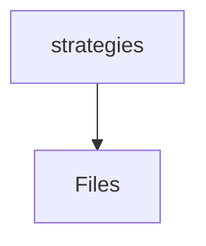

# 📁 Strategies Directory

[backend](/backend) > [src](/backend/src) > [modules](/backend/src/modules) > [payment](/backend/src/modules/payment) > [strategies](/backend/src/modules/payment/strategies)

## 🎯 Purpose
A high-level module handling `strategies` logic within the Mavluda Beauty ecosystem. This directory adheres to our "Luxury Professional" architectural standards.


## 🏗️ Architecture



## 📄 File Registry
| File Name | Type | Responsibility | Key Aliases Used |
|-----------|------|----------------|------------------|
| `alif-pay.strategy.ts` | TypeScript | Provides localized typescript definitions. | @nestjs/common |
| `mock-card.strategy.ts` | TypeScript | Provides localized typescript definitions. | @nestjs/common |
| `payment.strategy.ts` | TypeScript | Provides localized typescript definitions. | None |

## 🔗 Dependencies
- `@nestjs/common`

## 🛠️ Usage
```typescript
// Architectural overview snippet
import { InternalLogic } from './internal-file';
// Ensure adherence to Hexagonal / FSD principles
```
