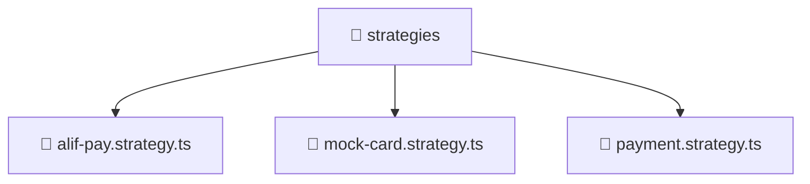

# 📁 strategies

[Root](/../../../../../README.md) / [backend](../../../../README.md) / [src](../../../README.md) / [modules](../../README.md) / [payment](../README.md) / [strategies](./README.md)

## 🎯 Purpose
Delivering luxury-tier architectural components and high-performance logic for the **strategies** domain. This directory is a crucial part of the Mavluda Beauty full-stack ecosystem, ensuring seamless scalability, robust performance, and an elite digital experience.

## 🏗️ Architecture


## 📄 File Registry
| File Name | Type | Responsibility | Key Aliases Used |
|---|---|---|---|
| `alif-pay.strategy.ts` | TypeScript | Provides core logic and orchestration for alif-pay.strategy.ts. | @nestjs |
| `mock-card.strategy.ts` | TypeScript | Provides core logic and orchestration for mock-card.strategy.ts. | @nestjs |
| `payment.strategy.ts` | TypeScript | Provides core logic and orchestration for payment.strategy.ts. | N/A |


## 🔗 Dependencies
**Internal / Aliases:**
- `@nestjs/common`


## 🛠️ Usage
```typescript
// Example usage within the Mavluda Beauty ecosystem
import { relevantMember } from './alif-pay.strategy';

// Integrate into the application architecture
relevantMember.execute();
```
