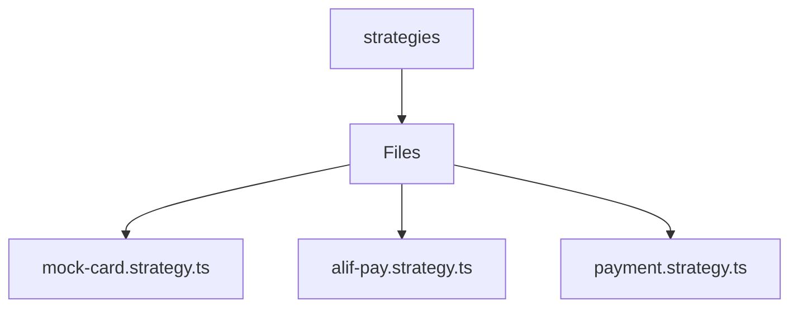

# 🏷️ Strategies Directory

> *Elegance, Precision, and Luxury Professionalism — The Mavluda Beauty Standard.*

## 🧭 Breadcrumb Navigation
[backend](/backend) ➔ [src](/backend/src) ➔ [modules](/backend/src/modules) ➔ [payment](/backend/src/modules/payment) ➔ [strategies](/backend/src/modules/payment/strategies)

## 🎯 Purpose
This directory encapsulates the essential architecture and logic for the **Strategies** domain within the Mavluda Beauty ecosystem. It serves as a foundational component ensuring robust, scalable, and elegant operations.

## 🏗️ Architecture


## 📄 File Registry
| File Name | Type | Responsibility | Key Aliases Used |
|---|---|---|---|
| `mock-card.strategy.ts` | TypeScript | Exports: MockCardStrategy | None |
| `alif-pay.strategy.ts` | TypeScript | Exports: AlifPayStrategy | None |
| `payment.strategy.ts` | TypeScript | Exports: PaymentResult, InitiatePaymentDto, PaymentCallbackData... | None |

## 🔗 Dependencies
- `@nestjs/common`

## 🛠️ Usage
```typescript
// To utilize the luxurious capabilities of this module:
import { MockCardStrategy } from './path/to/mockcardstrategy';

// Ensure properly typed interactions per Mavluda Beauty standards
```
