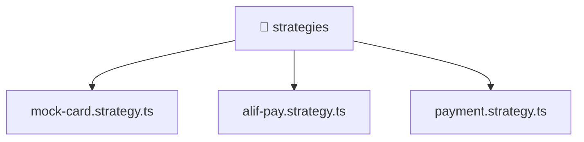

[🏠 Home](../../../../../README.md) > [backend](../../../../README.md) > [src](../../../README.md) > [modules](../../README.md) > [payment](../README.md) > [strategies](./README.md)

# 📁 strategies

### 🎯 PURPOSE
Welcome to the exquisite **strategies** module of the Mavluda Beauty ecosystem. This directory handles specific domain assets and logic. It is designed adhering to our 'Luxury Professional' standards.

### 🏗️ ARCHITECTURE


### 📄 FILE REGISTRY
| File Name | Type | Responsibility | Key Aliases Used |
|---|---|---|---|
| `alif-pay.strategy.ts` | TypeScript File | Provides injectable business logic or services Defines classes: AlifPayStrategy. | @nestjs |
| `mock-card.strategy.ts` | TypeScript File | Provides injectable business logic or services Defines classes: MockCardStrategy. | @nestjs |
| `payment.strategy.ts` | TypeScript File | Defines interfaces/types: PaymentResult, InitiatePaymentDto, PaymentCallbackData. | None |

### 🔗 DEPENDENCIES
- `@nestjs/common`

### 🛠️ USAGE
```typescript
// Example interaction or integration snippet
// Import members from strategies based on module boundaries
```
