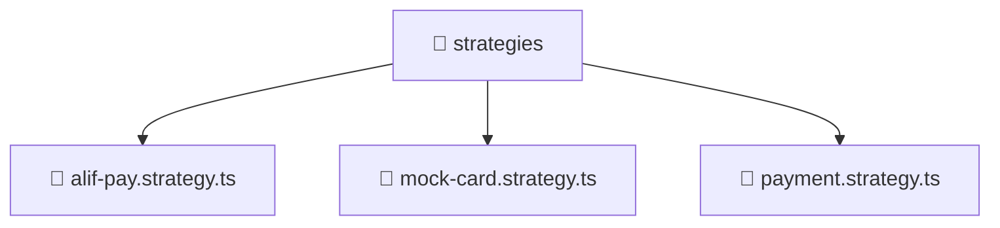

# 📁 strategies

[Root](/.) > [backend](/backend) > [src](/backend/src) > [modules](/backend/src/modules) > [payment](/backend/src/modules/payment) > [strategies](/backend/src/modules/payment/strategies)

## 🎯 Purpose
Backend module defining application routes, business logic, and data access for the domain.

## 🏗️ Architecture


## 📄 File Registry
| File Name | Type | Responsibility | Key Aliases Used |
|---|---|---|---|
| `alif-pay.strategy.ts` | TypeScript | Provides core logic and orchestration for alif-pay.strategy.ts. | @nestjs |
| `mock-card.strategy.ts` | TypeScript | Provides core logic and orchestration for mock-card.strategy.ts. | @nestjs |
| `payment.strategy.ts` | TypeScript | Provides core logic and orchestration for payment.strategy.ts. | N/A |

## 🔗 Dependencies
- `@nestjs/common`

## 🛠️ Usage
```typescript
import { Module } from '@nestjs/common';
// Import specific services/controllers provided by this module
```
