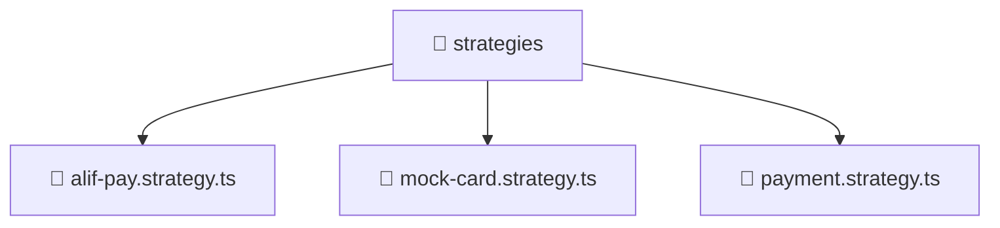

### 🧭 Breadcrumbs
[Root](/) > [backend](/backend) > [src](/backend/src) > [modules](/backend/src/modules) > [payment](/backend/src/modules/payment) > [strategies](/backend/src/modules/payment/strategies)

# 📁 Strategies Directory
**Architecture Layer:** Domain/Infrastructure Layer

## 🎯 Purpose
Provides luxury professional architectural implementation for the strategies module within the Mavluda Beauty ecosystem. Ensure robust functionality and elegant integration with the broader architecture.

## 🏗️ ARCHITECTURE


## 📄 FILE REGISTRY
| File Name | Type | Responsibility | Key Aliases Used |
|---|---|---|---|
| `alif-pay.strategy.ts` | TypeScript | Provides core logic and orchestration for alif-pay.strategy.ts. | @nestjs/common |
| `mock-card.strategy.ts` | TypeScript | Provides core logic and orchestration for mock-card.strategy.ts. | @nestjs/common |
| `payment.strategy.ts` | TypeScript | Provides core logic and orchestration for payment.strategy.ts. | N/A |

## 🔗 DEPENDENCIES
- `@nestjs/common`

## 🛠️ USAGE
```typescript
// Example architectural integration for strategies
// Utilize the exported members according to Mavluda Beauty's standard conventions.
```

---
*Maintained by Mavluda Beauty - Architecture & Engineering*

---
*Maintained by Mavluda Beauty - Architecture & Engineering*