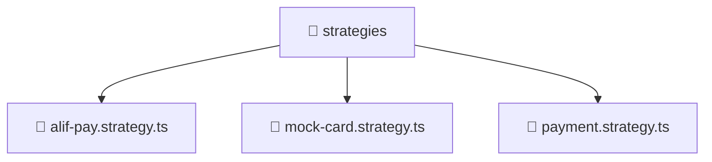

# 📁 strategies

[Root](/.) > [backend](/backend) > [src](/backend/src) > [modules](/backend/src/modules) > [payment](/backend/src/modules/payment) > [strategies](/backend/src/modules/payment/strategies)

## 🎯 Purpose
Delivering luxury-tier architectural components and high-performance logic for the **strategies** domain. This directory is a crucial part of the Mavluda Beauty full-stack ecosystem, ensuring seamless scalability, robust performance, and an elite digital experience.

## 🏗️ Architecture


## 📄 File Registry
| File Name | Type | Responsibility | Key Aliases Used |
|---|---|---|---|
| `alif-pay.strategy.ts` | TypeScript | Handles logic and definitions for alif-pay.strategy.ts | @nestjs/common |
| `mock-card.strategy.ts` | TypeScript | Handles logic and definitions for mock-card.strategy.ts | @nestjs/common |
| `payment.strategy.ts` | TypeScript | Handles logic and definitions for payment.strategy.ts | None |

## 🔗 Dependencies
- `@nestjs/common`

## 🛠️ Usage
```typescript
// Example usage within the Mavluda Beauty ecosystem
import { relevantMember } from './strategies';

// Integrate into the application architecture
relevantMember.execute();
```
