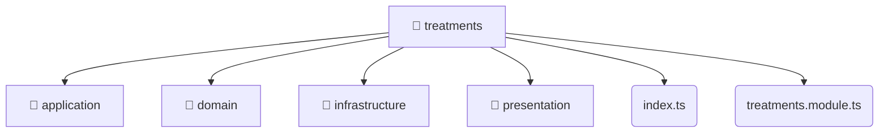

# [root](/) / [backend](/backend) / [src](/backend/src) / [modules](/backend/src/modules) / [treatments](/backend/src/modules/treatments)

## 🏷️ 📁 Treatments

### 🎯 PURPOSE
The `treatments` directory forms a critical foundation within the Mavluda Beauty ecosystem, meticulously orchestrating the treatments logic to ensure a seamless and premium experience.

### 🏗️ ARCHITECTURE


### 📄 FILE REGISTRY
| File Name | Type | Responsibility | Key Aliases Used |
|---|---|---|---|
| `index.ts` | `ts` | Core logic implementation. | None |
| `treatments.module.ts` | `ts` | Module configuration and provider registration. | @modules, @nestjs |

### 🔗 DEPENDENCIES
- `./application/treatments.service`
- `./domain/treatments.entity`
- `./infrastructure/repositories/treatments.repository`
- `./infrastructure/schemas/treatments.schema`
- `./presentation/dto/create-treatments.dto`
- `./presentation/dto/update-treatments.dto`
- `./presentation/treatments.controller`
- `./treatments.module`
- `@modules/treatments/application/treatments.service`
- `@modules/treatments/infrastructure/repositories/treatments.repository`
- *...and more.*

### 🛠️ USAGE
```typescript
// Seamlessly integrate treatments into your refined workflows:
import { /* exported members */ } from '@path/to/treatments';
```
