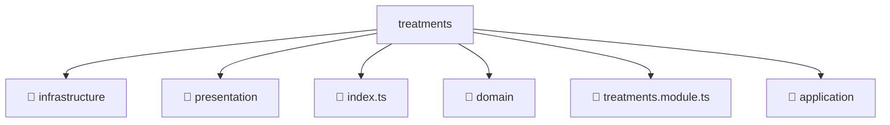

# 📂 TREATMENTS

> 💎 **Mavluda Beauty - Luxury Professional Architecture**

### 📍 Breadcrumb Navigation
`. > backend > src > modules > treatments`

## 🎯 PURPOSE
This directory encapsulates `Module Root` level functionality within the Mavluda Beauty ecosystem, ensuring proper separation of concerns and architectural transparency.

**FSD / Architecture Layer:** `Module Root`

## 🏗️ ARCHITECTURE


## 📄 FILE REGISTRY

| Item Name | Type | Responsibility | Key Aliases Used |
|-----------|------|----------------|------------------|
| `📁 infrastructure` | `Directory` | Subdirectory logic grouping | `None` |
| `📁 presentation` | `Directory` | Subdirectory logic grouping | `None` |
| `📄 index.ts` | `.ts` | General functionality | `None` |
| `📁 domain` | `Directory` | Subdirectory logic grouping | `None` |
| `📄 treatments.module.ts` | `.ts` | Module configuration | `@modules/treatments/infrastructure/schemas/treatments.schema, @nestjs/common, @nestjs/mongoose, @modules/treatments/presentation/treatments.controller, @modules/treatments/application/treatments.service, @modules/treatments/infrastructure/repositories/treatments.repository` |
| `📁 application` | `Directory` | Subdirectory logic grouping | `None` |

## 🔗 DEPENDENCIES
- `@modules/treatments/infrastructure/schemas/treatments.schema`
- `@nestjs/common`
- `@nestjs/mongoose`
- `@modules/treatments/presentation/treatments.controller`
- `@modules/treatments/application/treatments.service`
- `@modules/treatments/infrastructure/repositories/treatments.repository`

## 🛠️ USAGE
```typescript
// Example usage context
import { ... } from './index';

// Integrate index logic into your feature.
```
