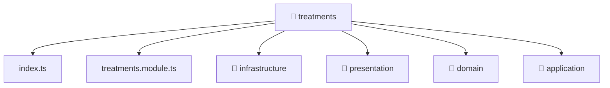

[🏠 Home](../../../../README.md) > [backend](../../../README.md) > [src](../../README.md) > [modules](../README.md) > [treatments](./README.md)

# 📁 treatments

### 🎯 PURPOSE
Welcome to the exquisite **treatments** module of the Mavluda Beauty ecosystem. This directory handles specific domain assets and logic. It is designed adhering to our 'Luxury Professional' standards.

### 🏗️ ARCHITECTURE


### 📄 FILE REGISTRY
| File Name | Type | Responsibility | Key Aliases Used |
|---|---|---|---|
| `index.ts` | TypeScript File | Exports or orchestrates module members. | None |
| `treatments.module.ts` | Angular Module | Configures an application module or layer Defines classes: TreatmentsModule. | @nestjs, @modules |

### 🔗 DEPENDENCIES
- `@modules/treatments/application/treatments.service`
- `@modules/treatments/infrastructure/repositories/treatments.repository`
- `@modules/treatments/presentation/treatments.controller`
- `@nestjs/common`
- `@nestjs/mongoose`

### 🛠️ USAGE
```typescript
// Example interaction or integration snippet
// Import members from treatments based on module boundaries
```
