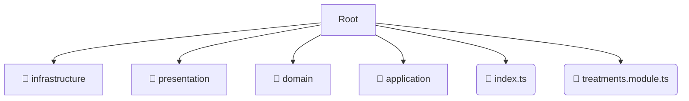

# 📂 treatments

*Breadcrumbs:* [backend](/backend) / [src](/backend/src) / [modules](/backend/src/modules) / [treatments](/backend/src/modules/treatments)

## 🎯 PURPOSE
This directory `treatments` is an integral part of the Mavluda Beauty ecosystem. It supports the scalable NestJS backend architecture.
This directory is meticulously maintained to uphold the 'Luxury Professional' standards of the Mavluda Beauty brand.

## 🏗️ ARCHITECTURE


## 📄 FILE REGISTRY
| File Name | Type | Responsibility | Key Aliases Used |
|---|---|---|---|
| `index.ts` | `ts` | Core functionality | `None` |
| `treatments.module.ts` | `ts` | Module configuration | `@nestjs/common, @modules/treatments/presentation/treatments.controller, @modules/treatments/infrastructure/repositories/treatments.repository...` |

## 🔗 DEPENDENCIES
- `@nestjs/common`
- `@modules/treatments/presentation/treatments.controller`
- `@modules/treatments/infrastructure/repositories/treatments.repository`
- `@modules/treatments/application/treatments.service`
- `@modules/treatments/infrastructure/schemas/treatments.schema`
- `@nestjs/mongoose`

## 🛠️ USAGE
```typescript
// Example placeholder for interacting with the treatments module
import { example } from './index.ts';
```
