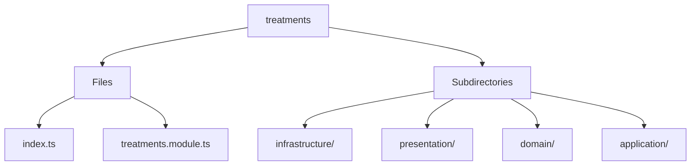

# 🏷️ Treatments Directory

> *Elegance, Precision, and Luxury Professionalism — The Mavluda Beauty Standard.*

## 🧭 Breadcrumb Navigation
[backend](/backend) ➔ [src](/backend/src) ➔ [modules](/backend/src/modules) ➔ [treatments](/backend/src/modules/treatments)

## 🎯 Purpose
This directory encapsulates the essential architecture and logic for the **Treatments** domain within the Mavluda Beauty ecosystem. It serves as a foundational component ensuring robust, scalable, and elegant operations.

## 🏗️ Architecture


## 📄 File Registry
| File Name | Type | Responsibility | Key Aliases Used |
|---|---|---|---|
| `index.ts` | TypeScript | Defines logic and structure for index.ts. | None |
| `treatments.module.ts` | TypeScript | Exports: TreatmentsModule | @modules |

## 🔗 Dependencies
- `@modules/treatments/application/treatments.service`
- `@modules/treatments/infrastructure/repositories/treatments.repository`
- `@modules/treatments/infrastructure/schemas/treatments.schema`
- `@modules/treatments/presentation/treatments.controller`
- `@nestjs/common`
- `@nestjs/mongoose`

## 🛠️ Usage
```typescript
// To utilize the luxurious capabilities of this module:
import { TreatmentsModule } from './path/to/treatmentsmodule';

// Ensure properly typed interactions per Mavluda Beauty standards
```
