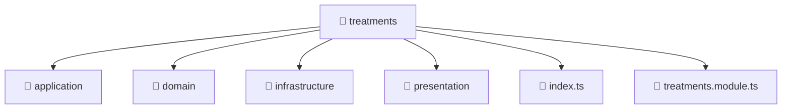

# 📁 Treatments

[Root](/.) > [backend](/backend) > [src](/backend/src) > [modules](/backend/src/modules) > [treatments](/backend/src/modules/treatments)

## 🎯 Purpose
Delivering luxury-tier architectural components and high-performance logic for the **treatments** domain. This directory is a crucial part of the Mavluda Beauty full-stack ecosystem, ensuring seamless scalability, robust performance, and an elite digital experience.

## 🏗️ Architecture


## 📄 File Registry
| File Name | Type | Responsibility | Key Aliases Used |
|---|---|---|---|
| `index.ts` | TypeScript/JavaScript | Provides core logic and orchestration for index.ts. | N/A |
| `treatments.module.ts` | TypeScript/JavaScript | Defines the architectural module boundaries for treatments.module.ts. | @modules, @nestjs |

## 🔗 Dependencies
- `@modules/treatments/application/treatments.service`
- `@modules/treatments/infrastructure/repositories/treatments.repository`
- `@modules/treatments/presentation/treatments.controller`
- `@nestjs/common`
- `@nestjs/mongoose`

## 🛠️ Usage
```typescript
// Example usage within the Mavluda Beauty ecosystem
import { relevantMember } from './treatments';

// Integrate into the application architecture
relevantMember.execute();
```
