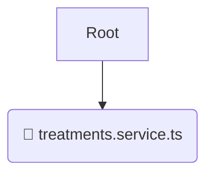

# 📱 application

*Breadcrumbs:* [backend](/backend) / [src](/backend/src) / [modules](/backend/src/modules) / [treatments](/backend/src/modules/treatments) / [application](/backend/src/modules/treatments/application)

## 🎯 PURPOSE
This directory `application` is an integral part of the Mavluda Beauty ecosystem. It orchestrates use cases, coordinating between domain and infrastructure layers.
This directory is meticulously maintained to uphold the 'Luxury Professional' standards of the Mavluda Beauty brand.

## 🏗️ ARCHITECTURE


## 📄 FILE REGISTRY
| File Name | Type | Responsibility | Key Aliases Used |
|---|---|---|---|
| `treatments.service.ts` | `ts` | Core functionality | `@common/utils, @nestjs/common` |

## 🔗 DEPENDENCIES
- `@common/utils`
- `@nestjs/common`

## 🛠️ USAGE
```typescript
// Example placeholder for interacting with the application module
import { example } from './treatments.service.ts';
```
