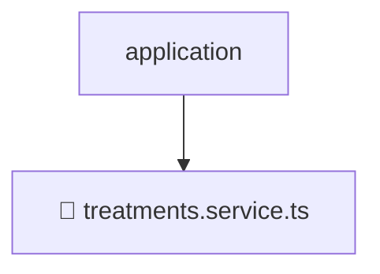

# 📂 APPLICATION

> 💎 **Mavluda Beauty - Luxury Professional Architecture**

### 📍 Breadcrumb Navigation
`. > backend > src > modules > treatments > application`

## 🎯 PURPOSE
This directory encapsulates `App` level functionality within the Mavluda Beauty ecosystem, ensuring proper separation of concerns and architectural transparency.

**FSD / Architecture Layer:** `App`

## 🏗️ ARCHITECTURE


## 📄 FILE REGISTRY

| Item Name | Type | Responsibility | Key Aliases Used |
|-----------|------|----------------|------------------|
| `📄 treatments.service.ts` | `.ts` | Service logic | `@nestjs/common, @common/utils` |

## 🔗 DEPENDENCIES
- `@nestjs/common`
- `@common/utils`

## 🛠️ USAGE
```typescript
// Example usage context
import { ... } from './treatments.service';

// Integrate treatments.service logic into your feature.
```
