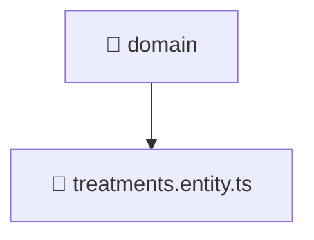

# 🧠 domain

[Root](/../../../../../README.md) / [backend](../../../../README.md) / [src](../../../README.md) / [modules](../../README.md) / [treatments](../README.md) / [domain](./README.md)

## 🎯 Purpose
Delivering luxury-tier architectural components and high-performance logic for the **domain** domain. This directory is a crucial part of the Mavluda Beauty full-stack ecosystem, ensuring seamless scalability, robust performance, and an elite digital experience.

## 🏗️ Architecture


## 📄 File Registry
| File Name | Type | Responsibility | Key Aliases Used |
|---|---|---|---|
| `treatments.entity.ts` | Entity | Provides core logic and orchestration for treatments.entity.ts. | N/A |


## 🔗 Dependencies
- No external dependencies.

## 🛠️ Usage
```typescript
// Example usage within the Mavluda Beauty ecosystem
import { relevantMember } from './treatments.entity';

// Integrate into the application architecture
relevantMember.execute();
```
