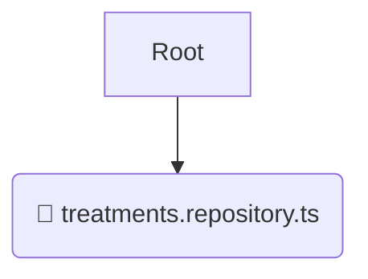

# 💾 repositories

*Breadcrumbs:* [backend](/backend) / [src](/backend/src) / [modules](/backend/src/modules) / [treatments](/backend/src/modules/treatments) / [infrastructure](/backend/src/modules/treatments/infrastructure) / [repositories](/backend/src/modules/treatments/infrastructure/repositories)

## 🎯 PURPOSE
This directory `repositories` is an integral part of the Mavluda Beauty ecosystem. It handles external integrations, databases, and low-level infrastructural concerns.
This directory is meticulously maintained to uphold the 'Luxury Professional' standards of the Mavluda Beauty brand.

## 🏗️ ARCHITECTURE


## 📄 FILE REGISTRY
| File Name | Type | Responsibility | Key Aliases Used |
|---|---|---|---|
| `treatments.repository.ts` | `ts` | Core functionality | `@nestjs/mongoose, @nestjs/common` |

## 🔗 DEPENDENCIES
- `@nestjs/mongoose`
- `@nestjs/common`

## 🛠️ USAGE
```typescript
// Example placeholder for interacting with the repositories module
import { example } from './treatments.repository.ts';
```
