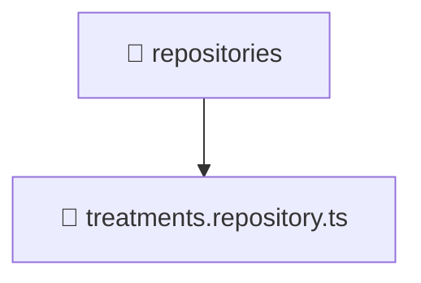

<!--
Mavluda Beauty - Luxury Professional Documentation
Generated for 100% Architectural Transparency
-->
[Home](../../../../../../README.md) > [backend](../../../../../README.md) > [src](../../../../README.md) > [modules](../../../README.md) > [treatments](../../README.md) > [infrastructure](../README.md) > [repositories](./README.md)

# 📁 REPOSITORIES Directory

## 🎯 PURPOSE
Provides implementations for external concerns like databases, repositories, and third-party integrations.

## 🏗️ ARCHITECTURE


## 📄 FILE REGISTRY
| File Name | Type | Responsibility | Key Aliases Used |
|---|---|---|---|
| `treatments.repository.ts` | TypeScript | Core logic implementation. | @nestjs |


## 🔗 DEPENDENCIES
- `@nestjs/common`
- `@nestjs/mongoose`
- `mongoose`
- `../../domain/treatments.entity`

## 🛠️ USAGE
```typescript
// Example placeholder for interacting with repositories
// Consult the individual files in the registry for specific APIs.
```
