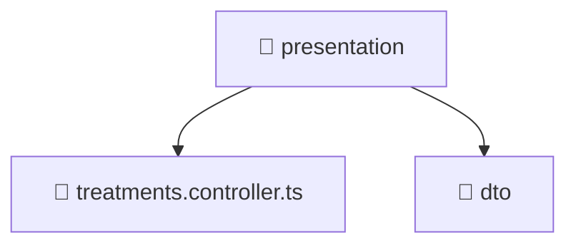

### 🧭 Breadcrumbs
[Root](/) > [backend](/backend) > [src](/backend/src) > [modules](/backend/src/modules) > [treatments](/backend/src/modules/treatments) > [presentation](/backend/src/modules/treatments/presentation)

# 📁 Presentation Directory
**Architecture Layer:** Domain/Infrastructure Layer

## 🎯 Purpose
Provides luxury professional architectural implementation for the presentation module within the Mavluda Beauty ecosystem. Ensure robust functionality and elegant integration with the broader architecture.

## 🏗️ ARCHITECTURE


## 📄 FILE REGISTRY
| File Name | Type | Responsibility | Key Aliases Used |
|---|---|---|---|
| `treatments.controller.ts` | TypeScript | Handles incoming HTTP requests and routing for treatments.controller.ts. | @nestjs/common, @nestjs/platform-express, @modules/treatments |

## 🔗 DEPENDENCIES
- `@modules/treatments`
- `@nestjs/common`
- `@nestjs/platform-express`

## 🛠️ USAGE
```typescript
// Example architectural integration for presentation
// Utilize the exported members according to Mavluda Beauty's standard conventions.
```

---
*Maintained by Mavluda Beauty - Architecture & Engineering*

---
*Maintained by Mavluda Beauty - Architecture & Engineering*