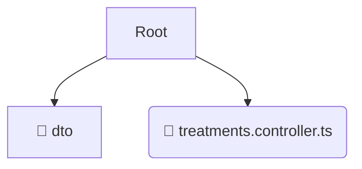

# 🎭 presentation

*Breadcrumbs:* [backend](/backend) / [src](/backend/src) / [modules](/backend/src/modules) / [treatments](/backend/src/modules/treatments) / [presentation](/backend/src/modules/treatments/presentation)

## 🎯 PURPOSE
This directory `presentation` is an integral part of the Mavluda Beauty ecosystem. It serves as the entry point for incoming requests, managing controllers and API routing.
This directory is meticulously maintained to uphold the 'Luxury Professional' standards of the Mavluda Beauty brand.

## 🏗️ ARCHITECTURE


## 📄 FILE REGISTRY
| File Name | Type | Responsibility | Key Aliases Used |
|---|---|---|---|
| `treatments.controller.ts` | `ts` | Core functionality | `@modules/treatments, @nestjs/common, @nestjs/platform-express` |

## 🔗 DEPENDENCIES
- `@modules/treatments`
- `@nestjs/common`
- `@nestjs/platform-express`

## 🛠️ USAGE
```typescript
// Example placeholder for interacting with the presentation module
import { example } from './treatments.controller.ts';
```
