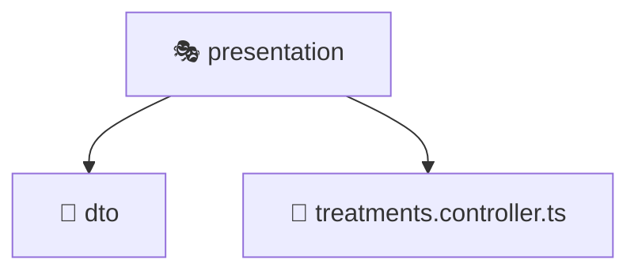

# 🎭 presentation

[Root](/../../../../../README.md) / [backend](../../../../README.md) / [src](../../../README.md) / [modules](../../README.md) / [treatments](../README.md) / [presentation](./README.md)

## 🎯 Purpose
Delivering luxury-tier architectural components and high-performance logic for the **presentation** domain. This directory is a crucial part of the Mavluda Beauty full-stack ecosystem, ensuring seamless scalability, robust performance, and an elite digital experience.

## 🏗️ Architecture


## 📄 File Registry
| File Name | Type | Responsibility | Key Aliases Used |
|---|---|---|---|
| `treatments.controller.ts` | Controller | Handles incoming HTTP requests and routing for treatments.controller.ts. | @nestjs |


## 🔗 Dependencies
**Internal / Aliases:**
- `@nestjs/platform-express`

**External:**
- `multer`
- `path`


## 🛠️ Usage
```typescript
// Example usage within the Mavluda Beauty ecosystem
import { relevantMember } from './treatments.controller';

// Integrate into the application architecture
relevantMember.execute();
```
