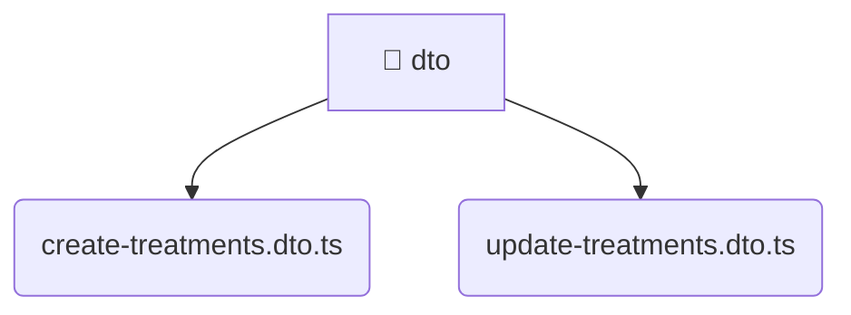

# [backend](/backend) / [src](/backend/src) / [modules](/backend/src/modules) / [treatments](/backend/src/modules/treatments) / [presentation](/backend/src/modules/treatments/presentation) / [dto](/backend/src/modules/treatments/presentation/dto)

## 🏷️ 📨 Dto

### 🎯 PURPOSE
The `dto` directory forms a critical foundation within the Mavluda Beauty ecosystem, meticulously orchestrating the dto logic to ensure a seamless and premium experience. Rooted in the NestJS backend architecture, it delivers robust, high-performance operations tailored for high-end beauty and wedding services.

### 🏗️ ARCHITECTURE


### 📄 FILE REGISTRY
| File Name | Type | Responsibility | Key Aliases Used |
|---|---|---|---|
| `create-treatments.dto.ts` | `ts` | Encapsulates premium logic and definitions for `create-treatments.dto.ts`. | None |
| `update-treatments.dto.ts` | `ts` | Encapsulates premium logic and definitions for `update-treatments.dto.ts`. | @nestjs/mapped-types |


### 🔗 DEPENDENCIES
- `@nestjs/mapped-types`

### 🛠️ USAGE
```typescript
// Seamlessly integrate dto into your refined workflows:
import { /* exported members */ } from '@path/to/dto';
```
