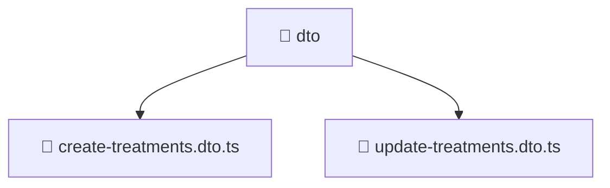

<!--
Mavluda Beauty - Luxury Professional Documentation
Generated for 100% Architectural Transparency
-->
[Home](../../../../../../README.md) > [backend](../../../../../README.md) > [src](../../../../README.md) > [modules](../../../README.md) > [treatments](../../README.md) > [presentation](../README.md) > [dto](./README.md)

# 📁 DTO Directory

## 🎯 PURPOSE
Handles incoming HTTP requests, controllers, and data transfer objects (DTOs).

## 🏗️ ARCHITECTURE


## 📄 FILE REGISTRY
| File Name | Type | Responsibility | Key Aliases Used |
|---|---|---|---|
| `create-treatments.dto.ts` | TypeScript | Data Transfer Object definition. | - |
| `update-treatments.dto.ts` | TypeScript | Data Transfer Object definition. | @nestjs |


## 🔗 DEPENDENCIES
- `class-transformer`
- `@nestjs/mapped-types`
- `./create-treatments.dto`

## 🛠️ USAGE
```typescript
// Example placeholder for interacting with dto
// Consult the individual files in the registry for specific APIs.
```
