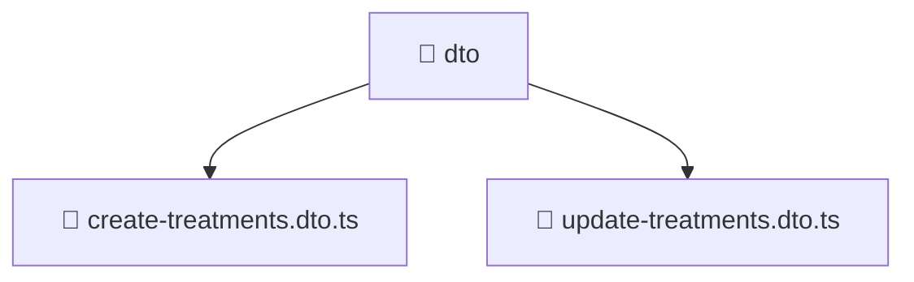

# 📁 dto

[Root](/.) > [backend](/backend) > [src](/backend/src) > [modules](/backend/src/modules) > [treatments](/backend/src/modules/treatments) > [presentation](/backend/src/modules/treatments/presentation) > [dto](/backend/src/modules/treatments/presentation/dto)

## 🎯 Purpose
Backend module defining application routes, business logic, and data access for the domain.

## 🏗️ Architecture


## 📄 File Registry
| File Name | Type | Responsibility | Key Aliases Used |
|---|---|---|---|
| `create-treatments.dto.ts` | TypeScript | Provides core logic and orchestration for create-treatments.dto.ts. | N/A |
| `update-treatments.dto.ts` | TypeScript | Provides core logic and orchestration for update-treatments.dto.ts. | @nestjs |

## 🔗 Dependencies
- `./create-treatments.dto`
- `@nestjs/mapped-types`
- `class-transformer`

## 🛠️ Usage
```typescript
import { Module } from '@nestjs/common';
// Import specific services/controllers provided by this module
```
