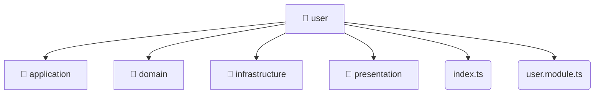

# [root](/) / [backend](/backend) / [src](/backend/src) / [modules](/backend/src/modules) / [user](/backend/src/modules/user)

## 🏷️ 📁 User

### 🎯 PURPOSE
The `user` backend module encapsulates the business logic, presentation, and data access for user.

### 🏗️ ARCHITECTURE


### 📄 FILE REGISTRY
| File Name | Type | Responsibility | Key Aliases Used |
|---|---|---|---|
| `index.ts` | `ts` | Core logic implementation. | None |
| `user.module.ts` | `ts` | Module configuration and provider registration. | @nestjs |

### 🔗 DEPENDENCIES
- `./application/user.service`
- `./domain/user.entity`
- `./infrastructure/repositories/user.repository`
- `./infrastructure/schemas/user.schema`
- `./presentation/dto/create-user.dto`
- `./presentation/dto/update-user.dto`
- `./presentation/user.controller`
- `./user.module`
- `@nestjs/common`
- `@nestjs/mongoose`

### 🛠️ USAGE
```typescript
// Seamlessly integrate user into your refined workflows:
import { /* exported members */ } from '@path/to/user';
```
