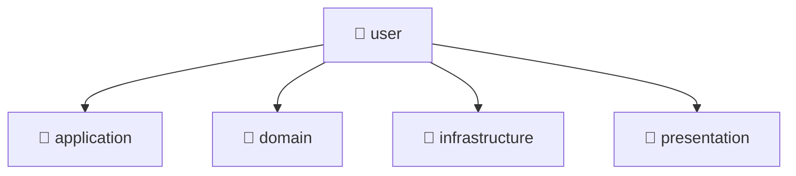

# 📁 user

[Root](/.) > [backend](/backend) > [src](/backend/src) > [modules](/backend/src/modules) > [user](/backend/src/modules/user)

## 🎯 Purpose
Delivering luxury-tier architectural components and high-performance logic for the **user** domain. This directory is a crucial part of the Mavluda Beauty full-stack ecosystem, ensuring seamless scalability, robust performance, and an elite digital experience.
> **FSD Layer:** Modules (Backend FSD) - Adhering to strict Feature Sliced Design architectural constraints.

## 🏗️ Architecture


## 📄 File Registry
| File Name | Type | Responsibility | Key Aliases Used |
|---|---|---|---|
| `index.ts` | File | Core logic and utilities for this domain. | N/A |
| `user.module.ts` | Module | Core logic and utilities for this domain. | @nestjs |


## 🔗 Dependencies
- `./application/user.service`
- `./domain/user.entity`
- `./infrastructure/repositories/user.repository`
- `./infrastructure/schemas/user.schema`
- `./presentation/dto/create-user.dto`
- `./presentation/dto/update-user.dto`
- `./user.module`
- `@nestjs/common`
- `@nestjs/mongoose`
- `./presentation/user.controller`

## 🛠️ Usage
```typescript
// Example usage within the Mavluda Beauty ecosystem
import { relevantMember } from './index';

// Integrate into the application architecture
relevantMember.execute();
```
