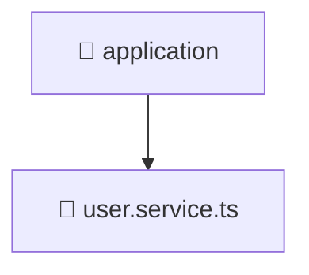

# 📁 application

[Root](/.) > [backend](/backend) > [src](/backend/src) > [modules](/backend/src/modules) > [user](/backend/src/modules/user) > [application](/backend/src/modules/user/application)

## 🎯 Purpose
Backend module defining application routes, business logic, and data access for the domain.

## 🏗️ Architecture


## 📄 File Registry
| File Name | Type | Responsibility | Key Aliases Used |
|---|---|---|---|
| `user.service.ts` | TypeScript | Encapsulates business logic and data access for user.service.ts. | @nestjs |

## 🔗 Dependencies
- `../domain/user.entity`
- `../infrastructure/repositories/user.repository`
- `@nestjs/common`
- `bcrypt`

## 🛠️ Usage
```typescript
import { Module } from '@nestjs/common';
// Import specific services/controllers provided by this module
```
