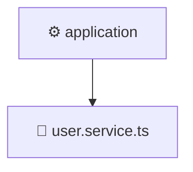

# ⚙️ application

[Root](/../../../../../README.md) / [backend](../../../../README.md) / [src](../../../README.md) / [modules](../../README.md) / [user](../README.md) / [application](./README.md)

## 🎯 Purpose
Delivering luxury-tier architectural components and high-performance logic for the **application** domain. This directory is a crucial part of the Mavluda Beauty full-stack ecosystem, ensuring seamless scalability, robust performance, and an elite digital experience.

## 🏗️ Architecture


## 📄 File Registry
| File Name | Type | Responsibility | Key Aliases Used |
|---|---|---|---|
| `user.service.ts` | Service | Encapsulates business logic and data access for user.service.ts. | @nestjs |


## 🔗 Dependencies
**Internal / Aliases:**
- `../domain/user.entity`
- `../infrastructure/repositories/user.repository`
- `@nestjs/common`

**External:**
- `bcrypt`


## 🛠️ Usage
```typescript
// Example usage within the Mavluda Beauty ecosystem
import { relevantMember } from './user.service';

// Integrate into the application architecture
relevantMember.execute();
```
