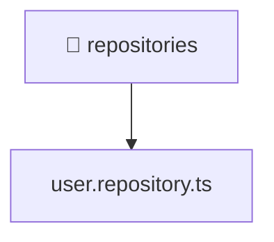

[🏠 Home](../../../../../../README.md) > [backend](../../../../../README.md) > [src](../../../../README.md) > [modules](../../../README.md) > [user](../../README.md) > [infrastructure](../README.md) > [repositories](./README.md)

# 📁 repositories

### 🎯 PURPOSE
Welcome to the exquisite **repositories** module of the Mavluda Beauty ecosystem. This directory handles specific domain assets and logic. It is designed adhering to our 'Luxury Professional' standards.

### 🏗️ ARCHITECTURE


### 📄 FILE REGISTRY
| File Name | Type | Responsibility | Key Aliases Used |
|---|---|---|---|
| `user.repository.ts` | TypeScript File | Provides injectable business logic or services Defines classes: UserRepository. | @nestjs |

### 🔗 DEPENDENCIES
- `@nestjs/common`
- `@nestjs/mongoose`
- `mongoose`

### 🛠️ USAGE
```typescript
// Example interaction or integration snippet
// Import members from repositories based on module boundaries
```
