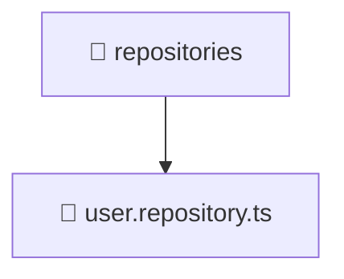

# 📁 repositories

[Root](/.) > [backend](/backend) > [src](/backend/src) > [modules](/backend/src/modules) > [user](/backend/src/modules/user) > [infrastructure](/backend/src/modules/user/infrastructure) > [repositories](/backend/src/modules/user/infrastructure/repositories)

## 🎯 Purpose
Backend module defining application routes, business logic, and data access for the domain.

## 🏗️ Architecture


## 📄 File Registry
| File Name | Type | Responsibility | Key Aliases Used |
|---|---|---|---|
| `user.repository.ts` | TypeScript | Provides core logic and orchestration for user.repository.ts. | @nestjs |

## 🔗 Dependencies
- `../../domain/user.entity`
- `../schemas/user.schema`
- `@nestjs/common`
- `@nestjs/mongoose`
- `mongoose`

## 🛠️ Usage
```typescript
import { Module } from '@nestjs/common';
// Import specific services/controllers provided by this module
```
