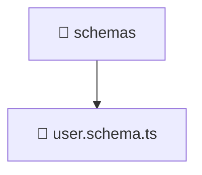

# 📁 Mavluda Beauty schemas

[backend](/backend) / [src](/backend/src) / [modules](/backend/src/modules) / [user](/backend/src/modules/user) / [infrastructure](/backend/src/modules/user/infrastructure) / [schemas](/backend/src/modules/user/infrastructure/schemas)

## 🎯 Purpose
Delivering luxury-tier architectural components and high-performance logic for the **schemas** domain. This directory is a crucial part of the Mavluda Beauty full-stack ecosystem, ensuring seamless scalability, robust performance, and an elite digital experience.

## 🏗️ Architecture


## 📄 File Registry
| File Name | Type | Responsibility | Key Aliases Used |
|---|---|---|---|
| `user.schema.ts` | Model/Schema | Defines persistence layer structure. | `@nestjs/mongoose` |


## 🔗 Dependencies
**Path Aliases:**
- `@nestjs/mongoose`

**External Packages:**
- `mongoose`


## 🛠️ Usage
```typescript
// Example integration for schemas
// Import capabilities from this directory to enrich your modules.
```
> This directory provides specialized logic tailored to the Mavluda Beauty standard.
