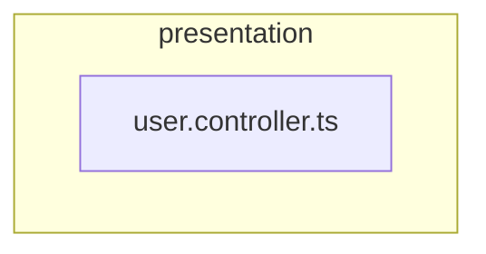

# 🎭 presentation

[backend](../../../../README.md) > [src](../../../README.md) > [modules](../../README.md) > [user](../README.md) > [presentation](README.md)

---

### 🎯 PURPOSE
Elevating the digital experience for the Mavluda Beauty ecosystem, this module manages the sophisticated Presentation Layer (Controllers, Resolvers, DTOs) operations.

*FSD Layer:* **Presentation Layer (Controllers, Resolvers, DTOs)**

---

### 🏗️ ARCHITECTURE



---

### 📄 FILE REGISTRY
| File Name | Type | Responsibility | Key Aliases Used |
|-----------|------|----------------|------------------|
| `user.controller.ts` | Controller | Handles controller logic for Mavluda Beauty's luxury standards. | `@modules, @common, @nestjs` |

---

### 🔗 DEPENDENCIES
**Key Path Aliases Detected:** `@modules`, `@common`, `@nestjs`

Notable imports:
- `./dto/update-user.dto`
- `multer`
- `../application/user.service`
- `@modules/user`
- `@common/interfaces/authenticated-request.interface`
- `path`
- `@nestjs/platform-express`
- `./dto/create-user.dto`
- `@nestjs/common`

---

### 🛠️ USAGE
To interact with this directory's luxurious logic, integrate its exported components or services directly into your feature modules. Ensure strict adherence to the Presentation Layer (Controllers, Resolvers, DTOs) boundaries.

```typescript
// Example integration snippet
import { FeatureModule } from '@path/to/presentation';
```
