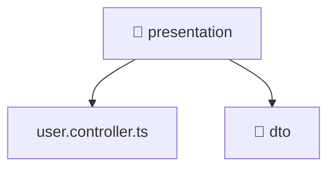

[🏠 Home](../../../../../README.md) > [backend](../../../../README.md) > [src](../../../README.md) > [modules](../../README.md) > [user](../README.md) > [presentation](./README.md)

# 📁 presentation

### 🎯 PURPOSE
Welcome to the exquisite **presentation** module of the Mavluda Beauty ecosystem. This directory focuses on orchestrating HTTP APIs. It is designed adhering to our 'Luxury Professional' standards.

### 🏗️ ARCHITECTURE


### 📄 FILE REGISTRY
| File Name | Type | Responsibility | Key Aliases Used |
|---|---|---|---|
| `user.controller.ts` | NestJS Controller | Handles incoming HTTP requests Defines classes: UserController. | @nestjs, @modules, @common |

### 🔗 DEPENDENCIES
- `@common/interfaces/authenticated-request.interface`
- `@modules/user`
- `@nestjs/platform-express`
- `multer`
- `path`

### 🛠️ USAGE
```typescript
// Example interaction or integration snippet
// Import members from presentation based on module boundaries
```
