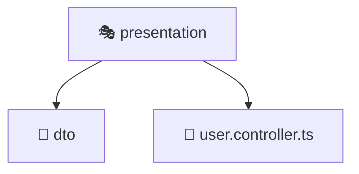

# 🎭 Presentation

[Root](../../../../../) > [backend](../../../../) > [src](../../../) > [modules](../../) > [user](../) > [presentation](./)

## 🎯 Purpose
Delivering luxury-tier architectural components and high-performance logic for the **Presentation** domain. This directory is a crucial part of the Mavluda Beauty full-stack ecosystem, ensuring seamless scalability, robust performance, and an elite digital experience.

**Architecture Layer:** Backend Infrastructure (Feature Sliced Design / Layered Architecture)

## 🏗️ Architecture


## 📄 File Registry
| File Name | Type | Responsibility | Key Aliases Used |
|---|---|---|---|
| `user.controller.ts` | TypeScript | Core logic and utilities for this domain. | @nestjs/common, @nestjs/platform-express, @modules/user |


## 🔗 Dependencies
- `@modules/user`
- `@nestjs/common`
- `@nestjs/platform-express`

## 🛠️ Usage
```markdown
> This directory acts primarily as a structural container or logic module.
> To interact with its contents, import the relevant exported members from the `index.ts` or specifically targeted files.
```
