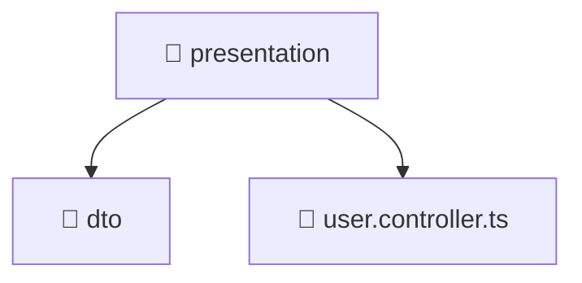

<!--
Mavluda Beauty - Luxury Professional Documentation
Generated for 100% Architectural Transparency
-->
[Home](../../../../../README.md) > [backend](../../../../README.md) > [src](../../../README.md) > [modules](../../README.md) > [user](../README.md) > [presentation](./README.md)

# 📁 PRESENTATION Directory

## 🎯 PURPOSE
Handles incoming HTTP requests, controllers, and data transfer objects (DTOs).

## 🏗️ ARCHITECTURE


## 📄 FILE REGISTRY
| File Name | Type | Responsibility | Key Aliases Used |
|---|---|---|---|
| `user.controller.ts` | TypeScript | Request routing and response handling. | @modules, @common, @nestjs |


## 🔗 DEPENDENCIES
- `../application/user.service`
- `@modules/user`
- `./dto/create-user.dto`
- `./dto/update-user.dto`
- `@common/interfaces/authenticated-request.interface`
- `@nestjs/platform-express`
- `multer`
- `path`

## 🛠️ USAGE
```typescript
// Example placeholder for interacting with presentation
// Consult the individual files in the registry for specific APIs.
```
