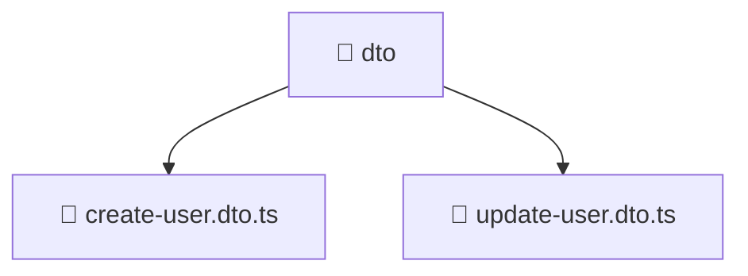

# 📁 dto

[Root](/../../../../../../README.md) / [backend](../../../../../README.md) / [src](../../../../README.md) / [modules](../../../README.md) / [user](../../README.md) / [presentation](../README.md) / [dto](./README.md)

## 🎯 Purpose
Delivering luxury-tier architectural components and high-performance logic for the **dto** domain. This directory is a crucial part of the Mavluda Beauty full-stack ecosystem, ensuring seamless scalability, robust performance, and an elite digital experience.

## 🏗️ Architecture


## 📄 File Registry
| File Name | Type | Responsibility | Key Aliases Used |
|---|---|---|---|
| `create-user.dto.ts` | DTO | Provides core logic and orchestration for create-user.dto.ts. | N/A |
| `update-user.dto.ts` | DTO | Provides core logic and orchestration for update-user.dto.ts. | @nestjs |


## 🔗 Dependencies
**Internal / Aliases:**
- `./create-user.dto`
- `@nestjs/mapped-types`


## 🛠️ Usage
```typescript
// Example usage within the Mavluda Beauty ecosystem
import { relevantMember } from './create-user.dto';

// Integrate into the application architecture
relevantMember.execute();
```
