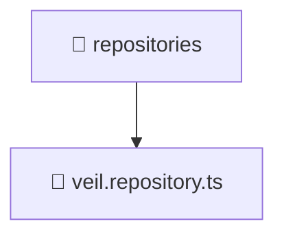

# 📁 Mavluda Beauty repositories

[backend](/backend) / [src](/backend/src) / [modules](/backend/src/modules) / [veil](/backend/src/modules/veil) / [infrastructure](/backend/src/modules/veil/infrastructure) / [repositories](/backend/src/modules/veil/infrastructure/repositories)

## 🎯 Purpose
Delivering luxury-tier architectural components and high-performance logic for the **repositories** domain. This directory is a crucial part of the Mavluda Beauty full-stack ecosystem, ensuring seamless scalability, robust performance, and an elite digital experience.

## 🏗️ Architecture


## 📄 File Registry
| File Name | Type | Responsibility | Key Aliases Used |
|---|---|---|---|
| `veil.repository.ts` | TypeScript Logic | Core logic and utilities for this domain. | `@nestjs/common, @nestjs/mongoose, @common/utils/file-system` |


## 🔗 Dependencies
**Path Aliases:**
- `@nestjs/common`
- `@nestjs/mongoose`
- `@common/utils/file-system`

**External Packages:**
- `mongoose`


## 🛠️ Usage
```typescript
// Example integration for repositories
// Import capabilities from this directory to enrich your modules.
```
> This directory provides specialized logic tailored to the Mavluda Beauty standard.
