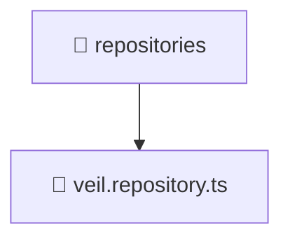

# 📁 repositories

[Root](/.) > [backend](/backend) > [src](/backend/src) > [modules](/backend/src/modules) > [veil](/backend/src/modules/veil) > [infrastructure](/backend/src/modules/veil/infrastructure) > [repositories](/backend/src/modules/veil/infrastructure/repositories)

## 🎯 Purpose
Backend module defining application routes, business logic, and data access for the domain.

## 🏗️ Architecture


## 📄 File Registry
| File Name | Type | Responsibility | Key Aliases Used |
|---|---|---|---|
| `veil.repository.ts` | TypeScript | Provides core logic and orchestration for veil.repository.ts. | @common, @nestjs |

## 🔗 Dependencies
- `../../domain/veil.entity`
- `../schemas/veil.schema`
- `@common/utils/file-system`
- `@nestjs/common`
- `@nestjs/mongoose`
- `mongoose`

## 🛠️ Usage
```typescript
import { Module } from '@nestjs/common';
// Import specific services/controllers provided by this module
```
